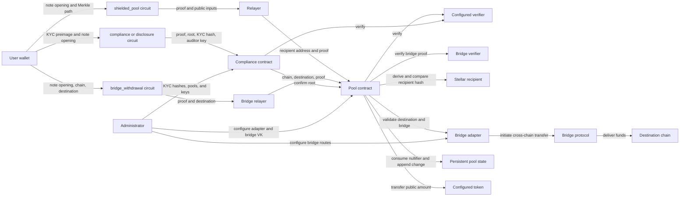

# DShield Threat Model

This document separates properties enforced by DShield's Noir circuits from
properties enforced by Soroban contracts and from operational assumptions. It
describes the current variable-amount note design.

The formal/symbolic CI harness in
[FORMAL_VERIFICATION.md](FORMAL_VERIFICATION.md) checks the named circuit
relations below against compiled Nargo artifacts. Its coverage is intentionally
limited; it is a guardrail for invariant drift, not a substitute for an
external audit.

## Security boundaries

| Component                   | Enforced properties                                                                                                                                                   | External assumptions                                                                                                                                                                                                               |
| --------------------------- | --------------------------------------------------------------------------------------------------------------------------------------------------------------------- | ---------------------------------------------------------------------------------------------------------------------------------------------------------------------------------------------------------------------------------- |
| `shielded_pool` circuit     | Note membership and opening; nullifier derivation; 64-bit note and withdrawal amounts; `withdraw_amount <= amount`; change commitment for `amount - withdraw_amount`. | Its public recipient field is not derived from a Stellar address.                                                                                                                                                                  |
| `bridge_withdrawal` circuit | Same as `shielded_pool` plus binding to cross-chain destination via `destination_hash = Poseidon2(chain_id, addr_left, addr_right)`.                                  | The public `destination_hash` field is not checked against bridge protocol expectations.                                                                                                                                           |
| Pool contract               | Known-root check, nullifier uniqueness, recipient-address binding, proof verification, change insertion, and token transfer.                                          | The configured verifier and token are trusted deployments. A relayer can censor or delay, but cannot redirect a valid withdrawal.                                                                                                  |
| Bridge adapter contract     | Destination encoding validation, destination-hash recomputation and verification, bridge protocol invocation.                                                         | The bridge protocol (e.g., Wormhole, CCTP) is trusted to deliver funds to the destination chain. The adapter admin can upgrade the implementation or pause bridging. Bridge security is **not** enforceable by DShield's circuits. |
| `compliance` circuit        | KYC-preimage knowledge, note ownership, equality of the disclosed and committed amounts, and 64-bit range.                                                            | KYC eligibility is an administrative policy decision. The `auditor_key` public input is not checked against a registry -- see [Auditor-key binding](#auditor-key-binding).                                                         |
| `disclosure` circuit        | KYC and note ownership plus `amount >= threshold`, without revealing the note amount.                                                                                 | The threshold's legal meaning is external policy. The `auditor_key` public input is not checked against a registry -- see [Auditor-key binding](#auditor-key-binding).                                                             |
| Compliance contract         | Registered-KYC and approved-pool-root checks, proof verification, and administrator authorization for registry, pool, and key changes.                                | The administrator is trusted to register correct hashes, pools, and verification keys.                                                                                                                                             |
| `hasher` circuit            | One two-input Poseidon2 hash.                                                                                                                                         | Domain separation and structure must be supplied correctly by callers.                                                                                                                                                             |

## Trust and data flow

The relayer is outside the cryptographic trust boundary. It sees public
withdrawal data and can refuse to submit it, but cannot change the payout
address while retaining a valid proof.

**Bridge adapter is a NEW trust boundary**: The adapter can censor, delay, or
fail to deliver funds, but cannot redirect them to a different destination
(destination is bound in the proof). Users must trust the bridge protocol
(Wormhole, CCTP, etc.) and the admin who controls the adapter configuration.

## Amount integrity and value conservation

A note commits to its value as
`H(H(H(LEAF_DOMAIN, nullifier), secret), amount)`. The shielded-pool,
compliance, and disclosure circuits use the same construction, so a valid
Merkle-membership proof pins the private `amount` witness to the original note.

The shielded-pool circuit passes `amount` and `withdraw_amount` through
`constrain_u64`, verifies `withdraw_amount <= amount`, and commits the change
for `amount - withdraw_amount`. The round-trip assertion in `constrain_u64` is
load-bearing: a bare Noir `as u64` truncates without constraining the source.
Without it, a near-modulus field value could wrap to a small integer and make
field arithmetic disagree with the comparison. The pool also rejects public
amount inputs with nonzero bytes above the low 64 bits instead of truncating.

## Recipient binding

Recipient binding deliberately crosses the circuit/contract boundary:

1. The circuit exposes `recipient`, but `assert(recipient == recipient)` only
   prevents compiler elimination; it does not constrain a Stellar address.
2. The pool derives `recipient_hash_from_address` from the payout address and
   compares it with the proof's public recipient field.
3. A mismatch is rejected before the token transfer.

Anti-front-running therefore depends on this contract comparison. Removing it
would allow a proof to remain valid while the payout address changes.

## Destination binding (bridge withdrawals)

Bridge withdrawals use a similar cross-boundary binding pattern:

1. The `bridge_withdrawal` circuit exposes `destination_hash` as a public input,
   computed as `Poseidon2(chain_id, addr_left, addr_right)`.
2. The bridge adapter contract recomputes this hash from the actual `chain_id`
   and `destination` parameters provided in the transaction.
3. If the recomputed hash doesn't match `destination_hash` from the proof, the
   withdrawal is rejected before any bridge protocol call.

This prevents a relayer or malicious actor from redirecting a bridge withdrawal
to a different chain or address after the proof is generated. However, it does
**not** protect against:

- **Bridge protocol failures**: The adapter trusts the bridge protocol (e.g.,
  Wormhole, CCTP) to deliver funds correctly. Protocol bugs, exploits, or
  censorship are outside DShield's control.
- **Adapter censorship**: The adapter admin can pause bridging or refuse to
  configure certain chains.
- **Destination chain risks**: Finality reverts, re-org attacks, or missing
  recipient addresses on the destination chain are not DShield's responsibility.

Users bridging funds should understand they are trusting:

1. The specific bridge protocol integration
2. The bridge adapter admin
3. The destination chain's security properties

## Auditor-key binding

`compliance` and `disclosure` both take `auditor_key` as a public input and
reference it inside an unconstrained Poseidon2 hash whose result is discarded
(assigned to `let _auditor_key_referenced = ...`, never asserted). That hash
adds nothing on its own.

What actually holds, and why:

1. Because `auditor_key` is a `pub` argument to `main`, it is part of the
   public-input vector the proof is verified against. A proof generated for
   `auditor_key = A` fails verification if the public inputs are changed to
   `auditor_key = B` -- this is a property of the proof system binding proof
   validity to its exact public inputs, not something the circuit body has to
   additionally enforce.
2. What is _not_ checked, at either the circuit or the compliance contract:
   that `auditor_key` corresponds to a real, registered auditor. The
   compliance contract's storage holds KYC hashes, approved pools, and the
   disclosure VK -- no auditor registry exists. A prover may set `auditor_key`
   to any `Field` value and produce a valid proof "addressed to" it.

So a disclosure proof cannot be silently redirected to a different auditor
after the fact, but nothing stops a user from generating one "for" an
auditor key nobody controls, and nothing on-chain distinguishes a real
auditor's key from an arbitrary one. Treat `auditor_key` as an opaque tag
carried through the system, not as an access-control mechanism.

## Nullifiers and replay protection

The circuit proves that the public nullifier hash derives from the private
nullifier, but cannot prove global uniqueness. The pool owns that stateful
guarantee: it rejects an existing persistent-storage entry and records each
successful spend. All withdrawals must use the same authoritative pool state.

## Circuit-specific guarantees

### Shielded pool

- Proves membership against the public root using a 20-level Merkle path and
  constrains each path selector to a bit.
- Binds nullifier, secret, and amount into the spent leaf.
- Enforces value conservation and a correctly formed change note.
- Leaves address binding to the pool contract.

### Compliance

- Binds the KYC preimage to the public KYC hash.
- Proves note ownership and that the disclosed amount equals its committed
  value.
- Depends on the contract to confirm KYC registration and an approved pool root.
- Carries `auditor_key` as an opaque public input; does not check it against
  a registry -- see [Auditor-key binding](#auditor-key-binding).

### Disclosure

- Provides the same KYC and note-ownership guarantees as compliance.
- Proves the committed note amount meets the public threshold.
- Does not establish the policy meaning of KYC status or the threshold.
- Same unchecked `auditor_key` as compliance.

### Hasher

The hasher is a compatibility primitive. Security properties such as domain
separation and note structure come from how callers chain its hashes.

## Residual assumptions

- Verification keys, pool addresses, token addresses, and administrators are
  configured correctly.
- **Bridge adapter and bridge verifier** (for cross-chain withdrawals) are
  trusted deployments. The bridge protocol (Wormhole, CCTP, etc.) is trusted
  to deliver funds to the destination chain. Bridge security is **outside**
  DShield's cryptographic guarantees.
- Users protect and retain note secrets, nullifiers, and KYC preimages. This
  is not purely a user-diligence assumption today: the deposit flow persists
  a note to `localStorage` only after `submitTransaction` resolves, with an
  unbounded confirmation poll in between, so a closed tab in that window can
  strand a confirmed deposit with no recoverable secret. Tracked as a bug,
  not a design assumption, in issue #63.
- No registry constrains `auditor_key` to real auditors -- see
  [Auditor-key binding](#auditor-key-binding).
- Frontend and relayer software encode public inputs exactly as contracts expect.
- Public token transfers reveal deposit and withdrawal amounts and addresses;
  privacy breaks the link between them rather than hiding either event.
- **Bridge withdrawals expose the destination chain and address** to the bridge
  protocol and any observers of the bridge transaction. Privacy is maintained
  between the source deposit and the bridge withdrawal, but not beyond the
  bridge adapter.
- Poseidon2 implementations in Noir, the frontend, and Soroban remain
  byte-for-byte compatible.

See [SECURITY.md](../SECURITY.md) for browser-storage, rate-limiting, reporting,
and deployment limitations.
