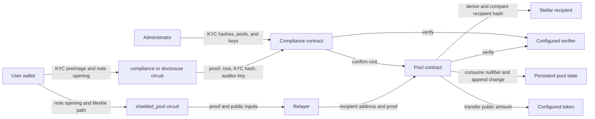

# DShield Threat Model

This document separates properties enforced by DShield's Noir circuits from
properties enforced by Soroban contracts and from operational assumptions. It
describes the current variable-amount note design.

The formal/symbolic CI harness in
[FORMAL_VERIFICATION.md](FORMAL_VERIFICATION.md) checks the named circuit
relations below against compiled Nargo artifacts. Its coverage is intentionally
limited; it is a guardrail for invariant drift, not a substitute for an
external audit.

## Security boundaries

| Component | Enforced properties | External assumptions |
| --- | --- | --- |
| `shielded_pool` circuit | Note membership and opening; nullifier derivation; 64-bit note and withdrawal amounts; `withdraw_amount <= amount`; change commitment for `amount - withdraw_amount`. | Its public recipient field is not derived from a Stellar address. |
| Pool contract | Known-root check, nullifier uniqueness, recipient-address binding, proof verification, change insertion, token transfer, and fee-carve-out bounds (`fee_amount <= payout` and `<= max_fee_bps`). | The configured verifier, token, and DEX router are trusted deployments. A relayer can censor or delay, but cannot redirect a valid withdrawal, and cannot charge a fee above the admin-configured (and hard-capped) `max_fee_bps` -- see [Fee abstraction](#fee-abstraction). |
| `compliance` circuit | KYC-preimage knowledge, note ownership, equality of the disclosed and committed amounts, and 64-bit range. | KYC eligibility is an administrative policy decision. The `auditor_key` public input is not checked against a registry -- see [Auditor-key binding](#auditor-key-binding). |
| `disclosure` circuit | KYC and note ownership plus `amount >= threshold`, without revealing the note amount. | The threshold's legal meaning is external policy. The `auditor_key` public input is not checked against a registry -- see [Auditor-key binding](#auditor-key-binding). |
| `view_disclosure` circuit | Knowledge of the `secret` behind a public `view_key`, and that the note it opens (with a private `nullifier`) is worth the disclosed public `amount` and a member of `merkle_root`. Never takes or outputs `nullifier` as a public value -- see [Viewing-key separation](#viewing-key-separation). | The recipient of `view_key` is trusted by the note holder to hold it as intended; nothing on-chain constrains who may be handed a viewing key. |
| Compliance contract | Registered-KYC and approved-pool-root checks, proof verification, and administrator authorization for registry, pool, and key changes. `verify_view_disclosure` is the one verification entrypoint that does not gate on KYC -- a viewing key is a delegation, not a regulatory attestation. | The administrator is trusted to register correct hashes, pools, and verification keys. |
| `hasher` circuit | One two-input Poseidon2 hash. | Domain separation and structure must be supplied correctly by callers. |

## Trust and data flow

The relayer is outside the cryptographic trust boundary. It sees public
withdrawal data and can refuse to submit it, but cannot change the payout
address while retaining a valid proof.

## Fee abstraction

Issue #149: a withdrawing caller never needs to hold or acquire the fee
asset (e.g. XLM) themselves. The relayer recovers its Soroban resource-fee
cost by carving a fee out of the payout and swapping it for the fee asset
on-chain, inside `withdraw` itself, rather than being paid in the withdrawn
asset directly or absorbing the cost.

**What is proof-committed vs. contract-only.** The withdrawal circuit commits
to a single `withdraw_amount` field; it has no concept of a fee split. The fee
carve-out is entirely a contract-level accounting decision made *after* proof
verification: `recipient_amount = payout - fee_amount`, where `fee_amount` is
an ordinary (non-proof-bound) parameter to `withdraw`, exactly like
`recipient` and `fee_recipient`. This means:

- A malicious relayer can set `fee_amount` to anything up to the payout, the
  same way it could already submit `recipient` incorrectly -- the pool does
  not know or care who is "supposed" to charge what.
- What bounds the damage is `max_fee_bps`, an admin-configured cap (itself
  capped by a hard-coded `MAX_FEE_BPS_CEILING`, 5%) that `withdraw` enforces
  against the proof-committed `payout` before any transfer happens. A relayer
  can overcharge up to that ceiling; it cannot exceed it, and it cannot ever
  redirect the *recipient's* remainder (only the frontend's own pre-signing
  quote protects the user from a relayer charging the full allowed ceiling
  instead of a fair market rate -- this is a UX/reputation check, not a
  cryptographic one).

**DEX-path liveness assumption.** The fee swap calls a configured,
Soroswap-router-compatible contract (`set_dex_router`) via
`swap_exact_tokens_for_tokens`. This introduces a new liveness dependency that
did not previously exist in `withdraw`:

- If no router/fee-asset is configured, `fee_amount > 0` withdrawals fail
  with `DexRouterNotSet`; `fee_amount = 0` withdrawals are unaffected (the
  original, pre-#149 code path).
- If a swap path exists but has no liquidity, or slippage exceeds
  `fee_min_out`, the swap -- and therefore the entire withdrawal -- reverts.
  `fee_min_out` is the relayer's own quote (sourced via
  `frontend/src/lib/stellar.ts`'s `quoteFeeSwap`), so a relayer that quotes
  honestly bears this risk itself; a relayer that quotes badly makes its own
  withdrawals fail more often, not the user's funds unsafe.
- The router contract is a trusted dependency in the same sense the verifier
  and token are: a malicious or buggy router could refuse to pay out, pay out
  less than it received, or behave inconsistently with the interface this
  contract assumes. It cannot, however, touch the recipient's own
  `recipient_amount` transfer, which happens independently beforehand.

**Approval scope.** The pool approves the router for exactly `fee_amount`,
expiring one ledger past the swap's deadline, rather than a standing
allowance -- a compromised or buggy router can only ever pull the one fee
slice it was just approved for, not an arbitrary amount at an arbitrary later
time.

## Amount integrity and value conservation

A note commits to its value as
`H(H(H(LEAF_DOMAIN, nullifier), secret), amount)`. The shielded-pool,
compliance, and disclosure circuits use the same construction, so a valid
Merkle-membership proof pins the private `amount` witness to the original note.

The shielded-pool circuit passes `amount` and `withdraw_amount` through
`constrain_u64`, verifies `withdraw_amount <= amount`, and commits the change
for `amount - withdraw_amount`. The round-trip assertion in `constrain_u64` is
load-bearing: a bare Noir `as u64` truncates without constraining the source.
Without it, a near-modulus field value could wrap to a small integer and make
field arithmetic disagree with the comparison. The pool also rejects public
amount inputs with nonzero bytes above the low 64 bits instead of truncating.

## Recipient binding

Recipient binding deliberately crosses the circuit/contract boundary:

1. The circuit exposes `recipient`, but `assert(recipient == recipient)` only
   prevents compiler elimination; it does not constrain a Stellar address.
2. The pool derives `recipient_hash_from_address` from the payout address and
   compares it with the proof's public recipient field.
3. A mismatch is rejected before the token transfer.

Anti-front-running therefore depends on this contract comparison. Removing it
would allow a proof to remain valid while the payout address changes.

## Auditor-key binding

`compliance` and `disclosure` both take `auditor_key` as a public input and
reference it inside an unconstrained Poseidon2 hash whose result is discarded
(assigned to `let _auditor_key_referenced = ...`, never asserted). That hash
adds nothing on its own.

What actually holds, and why:

1. Because `auditor_key` is a `pub` argument to `main`, it is part of the
   public-input vector the proof is verified against. A proof generated for
   `auditor_key = A` fails verification if the public inputs are changed to
   `auditor_key = B` -- this is a property of the proof system binding proof
   validity to its exact public inputs, not something the circuit body has to
   additionally enforce.
2. What is *not* checked, at either the circuit or the compliance contract:
   that `auditor_key` corresponds to a real, registered auditor. The
   compliance contract's storage holds KYC hashes, approved pools, and the
   disclosure VK -- no auditor registry exists. A prover may set `auditor_key`
   to any `Field` value and produce a valid proof "addressed to" it.

So a disclosure proof cannot be silently redirected to a different auditor
after the fact, but nothing stops a user from generating one "for" an
auditor key nobody controls, and nothing on-chain distinguishes a real
auditor's key from an arbitrary one. Treat `auditor_key` as an opaque tag
carried through the system, not as an access-control mechanism.

## Viewing-key separation

Every note has a spend-capable secret pair, `(nullifier, secret)`, and a
viewing key, `view_key = H(H(VIEW_DOMAIN, secret), 0)`, derived from `secret`
alone (`frontend/src/lib/poseidon2.ts`'s `computeViewKey`, matching the
`view_disclosure` circuit's `hash_view_key`). This is a deliberate asymmetry:

- **What a viewing key exposes.** Handed to a third party (an auditor, a
  bookkeeper, a co-signer) out of band, `view_key` lets that party confirm a
  future `view_disclosure` proof concerns the note it was derived from, and
  read the `amount` that proof discloses. It is a pure function of `secret`
  and nothing else.
- **What it cannot do.** `view_key` does not determine, and cannot be
  inverted to recover, `nullifier` -- the two are independent random field
  elements with no algebraic relationship. The `view_disclosure` circuit takes
  `nullifier` only as a private witness to reconstruct the note's leaf for the
  Merkle-membership check; it is never a public input, never output, and never
  constrained against `view_key`, `amount`, or anything else public. A
  verifier who receives a `view_disclosure` proof, its public inputs
  (`merkle_root`, `view_key`, `amount`), and `view_key` itself therefore has no
  public artifact from which to derive `nullifier`, and so no path to a valid
  `shielded_pool` withdrawal proof, which requires `nullifier` as a witness.
  `contracts/compliance/src/tests::test_view_disclosure_public_inputs_are_exactly_root_viewkey_amount`
  pins the public-input schema to exactly those three fields, and
  `frontend/src/lib/notes.test.ts`'s `deriveViewingKey` suite and
  `frontend/src/lib/poseidon2.test.ts`'s `computeViewKey` suite assert the
  derivation is a pure, nullifier-independent function of `secret`.
- **What a viewing key is not.** It is not a compliance attestation -- unlike
  `compliance`/`disclosure`, `verify_view_disclosure` does not check KYC
  registration, because sharing read access with a bookkeeper or co-signer is
  not a claim about the sharer's regulatory status. It is also not an access
  grant enforced on-chain: nothing prevents a note holder from generating a
  `view_disclosure` proof for a `view_key` they invented and never shared with
  anyone, the same caveat [Auditor-key binding](#auditor-key-binding) already
  notes for `auditor_key`.

## Nullifiers and replay protection

The circuit proves that the public nullifier hash derives from the private
nullifier, but cannot prove global uniqueness. The pool owns that stateful
guarantee: it rejects an existing persistent-storage entry and records each
successful spend. All withdrawals must use the same authoritative pool state.

## Circuit-specific guarantees

### Shielded pool

- Proves membership against the public root using a 20-level Merkle path and
  constrains each path selector to a bit.
- Binds nullifier, secret, and amount into the spent leaf.
- Enforces value conservation and a correctly formed change note.
- Leaves address binding to the pool contract.

### Compliance

- Binds the KYC preimage to the public KYC hash.
- Proves note ownership and that the disclosed amount equals its committed
  value.
- Depends on the contract to confirm KYC registration and an approved pool root.
- Carries `auditor_key` as an opaque public input; does not check it against
  a registry -- see [Auditor-key binding](#auditor-key-binding).

### Disclosure

- Provides the same KYC and note-ownership guarantees as compliance.
- Proves the committed note amount meets the public threshold.
- Does not establish the policy meaning of KYC status or the threshold.
- Same unchecked `auditor_key` as compliance.

### View disclosure

- Binds the prover's `secret` to the public `view_key`.
- Proves note membership and that the disclosed `amount` equals its committed
  value, using `nullifier` only as a private witness -- see
  [Viewing-key separation](#viewing-key-separation).
- Not gated on KYC: a viewing key is a delegation to view, not a regulatory
  attestation.
- Carries the same "no registry" caveat as `auditor_key`: nothing on-chain
  confirms `view_key` was actually shared with its intended recipient.

### Hasher

The hasher is a compatibility primitive. Security properties such as domain
separation and note structure come from how callers chain its hashes.

## Residual assumptions

- Verification keys, pool addresses, token addresses, and administrators are
  configured correctly.
- Users protect and retain note secrets, nullifiers, and KYC preimages. This
  is not purely a user-diligence assumption today: the deposit flow persists
  a note to `localStorage` only after `submitTransaction` resolves, with an
  unbounded confirmation poll in between, so a closed tab in that window can
  strand a confirmed deposit with no recoverable secret. Tracked as a bug,
  not a design assumption, in issue #63.
- No registry constrains `auditor_key` to real auditors -- see
  [Auditor-key binding](#auditor-key-binding).
- Users protect and retain their note secrets, and now also any viewing keys
  they derive and the recipients they share them with -- see
  [Viewing-key separation](#viewing-key-separation).
- Frontend and relayer software encode public inputs exactly as contracts expect.
- Public token transfers reveal deposit and withdrawal amounts and addresses;
  privacy breaks the link between them rather than hiding either event.
- Poseidon2 implementations in Noir, the frontend, and Soroban remain
  byte-for-byte compatible.
- A swap path from the withdrawn asset to the configured fee asset exists and
  has enough liquidity at the moment of withdrawal -- see
  [Fee abstraction](#fee-abstraction). Its absence fails the withdrawal
  cleanly rather than compromising it.

See [SECURITY.md](../SECURITY.md) for browser-storage, rate-limiting, reporting,
and deployment limitations.
